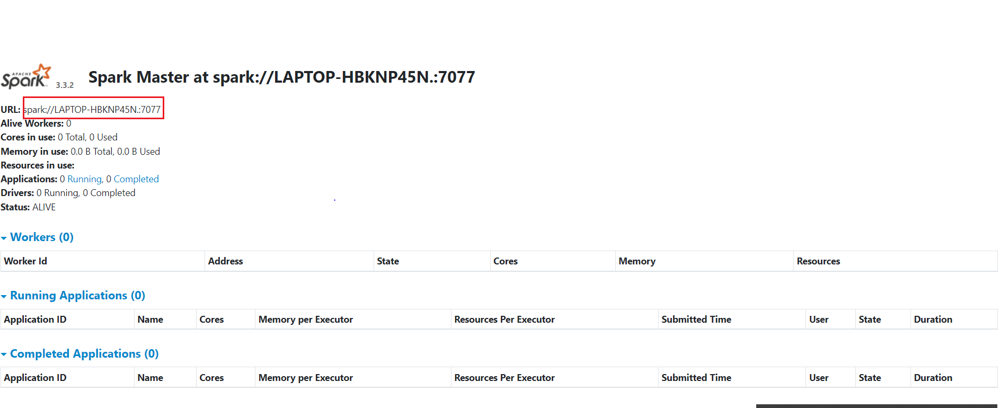

[](https://hadoop.apache.org/)
[](https://spark.apache.org/)
[](https://kafka.apache.org/)

# DATA WARE HOUSE - DATA LAKE #

Project about Data

# 📝 Menu

## [Install](#markdown-header-nstallation-tool)
    
  - [Install general system](#🏁-cài-đặt-chung)

  - [Hadoop](#hadoop)

  - [Apache Spark](#apache-spark)

  - [Kafka](#kafka)

***
## 🏁 **Cài đặt chung**

### **Cập nhật hệ thống Ubuntu**

```
sudo apt update && sudo apt upgrade
```

***
### **Cài đặt Java Development Kit (JDK)**

```
sudo apt install default-jdk
```
### **Nếu SSH daemon chưa được cài đặt, bạn có thể cài đặt nó bằng lệnh sau:**

```
sudo apt-get install openssh-server
```

#### Sau khi cài đặt xong, chạy lệnh sau để kiểm tra SSH daemon:

```
sudo service ssh start
```

#### Bật service ssh tự chạy khi khởi động ubuntu

```
sudo systemctl enable ssh
```

#### Kiểm tra lại trạng thái SSH daemon.

```
sudo service ssh status
```

***
### **Tạo key cho người dùng**

#### Tạo key bằng phương thức RSA và lưu ở .ssh/id_rsa
```
ssh-keygen -t rsa -P '' -f ~/.ssh/id_rsa
```

#### Tạo authorized_keys (Key xác thực người dùng ở local)
```
cat ~/.ssh/id_rsa.pub >> ~/.ssh/authorized_keys
```

#### Cấp quyền cho key xác thực người dùng

```
chmod 0600 ~/.ssh/authorized_keys
```

***
## [](https://hadoop.apache.org/)

## 🏁 **Cài đặt Hadoop**
***
### **Tải xuống Hadoop**

```
wget https://downloads.apache.org/hadoop/common/hadoop-3.3.4/hadoop-3.3.4.tar.gz
```

#### Sau khi tải xuống, giải nén file tar.gz bằng lệnh:

```
tar -xzvf hadoop-3.3.4.tar.gz
```


#### Di chuyển thư mục Hadoop đã giải nén vào thư mục /usr/local bằng lệnh:

```
sudo mv hadoop-3.3.4.tar.gz /usr/local/hadoop
```

***

### **Thiết lập biến môi trường cho Hadoop**

#### Trỏ vào file theo đường dẫn /etc/environment

```
sudo vi /etc/environment
```

#### Thêm các dòng sau vào tệp tin /etc/environment

```
HADOOP_HOME=/usr/local/hadoop
PATH=$PATH:$HADOOP_HOME/bin:$HADOOP_HOME/sbin
```

#### Thực hiện lệnh sau để áp dụng các thay đổi cho biến môi trường:

```
source /etc/environment
```

***

### **Cấu hình Hadoop**

#### Sửa tệp tin cấu hình của Hadoop (file /usr/local/hadoop/etc/hadoop/hadoop-env.sh) bằng cách thêm đường dẫn của JDK vào biến JAVA_HOME như sau:

```
export JAVA_HOME=/usr/lib/jvm/default-java
```


#### Cấu hình Hadoop bằng cách chỉnh sửa tệp tin /usr/local/hadoop/etc/hadoop/core-site.xml như sau:

```
<configuration>
  <property>
    <name>fs.defaultFS</name>
    <value>hdfs://localhost:9000</value>
  </property>
</configuration>
```

#### Chỉnh sửa tệp tin /usr/local/hadoop/etc/hadoop/hdfs-site.xml để cấu hình Hadoop để lưu trữ dữ liệu như sau:

```
<configuration>
  <property>
    <name>dfs.replication</name>
    <value>1</value>
  </property>
  <property>
    <name>dfs.namenode.name.dir</name>
    <value>/usr/local/hadoop/hadoop_data/hdfs/namenode</value>
  </property>
  <property>
    <name>dfs.datanode.data.dir</name>
    <value>/usr/local/hadoop/hadoop_data/hdfs/datanode</value>
  </property>
</configuration>
```

#### Chỉnh sửa tệp tin /usr/local/hadoop/etc/hadoop/mapred-site.xml để cấu hình Hadoop để lưu trữ dữ liệu như sau:

```
<configuration>
  <property>
    <name>mapreduce.framework.name</name>
    <value>yarn</value>
  </property>
</configuration>
```

#### Chỉnh sửa tệp tin /usr/local/hadoop/etc/hadoop/yarn-site.xml để cấu hình Hadoop để lưu trữ dữ liệu như sau:

```
<configuration>
  <property>
    <name>yarn.nodemanager.aux-services</name>
    <value>mapreduce_shuffle</value>
  </property>
  <property>
    <name>yarn.nodemanager.aux-services.mapreduce.shuffle.class</name>
    <value>org.apache.hadoop.mapred.ShuffleHandler</value>
  </property>
  <property>
    <name>yarn.resourcemanager.hostname</name>
    <value>127.0.0.1</value>
  </property>
  <property>
    <name>yarn.acl.enable</name>
    <value>0</value>
  </property>
  <property>
    <name>yarn.nodemanager.env-whitelist</name>&nbsp;&nbsp;&nbsp;
  <value>JAVA_HOME,HADOOP_COMMON_HOME,HADOOP_HDFS_HOME,HADOOP_CONF_DIR,CLASSPATH_PERPEND_DISTCACHE,HADOOP_YARN_HOME,HADOOP_MAPRED_HOME</value>
  </property>
</configuration>
```

***

### **Định dạng HDFS nghe mới khởi chạy hadoop lần đầu**

```
hdfs namenode -format
```
***
### ***Khởi động Hadoop bằng lệnh sau:***
```
$HADOOP_HOME/sbin/start-all.sh
```

#### :smile: Kiểm tra Data Node và Name Node trong Hadoop

#### Data Node: http://localhost:9864
#### Name Node: http://localhost:9870

***

## [](https://spark.apache.org/)

## 🏁 **Cài đặt Apache Spark**
***
### **Tải xuống Apache Spark**

```
wget https://dlcdn.apache.org/spark/spark-3.3.2/spark-3.3.2-bin-hadoop3-scala2.13.tgz
```

#### Sau khi tải xuống, giải nén file tar.gz bằng lệnh:

```
tar -xzvf spark-3.3.2-bin-hadoop3-scala2.13.tgz
```

#### Di chuyển thư mục Apache Spark đã giải nén vào thư mục /usr/local bằng lệnh:

```
sudo mv spark-3.3.2-bin-hadoop3-scala2.13 /usr/local/spark
```

***

### **Thiết lập biến môi trường cho Spark**

#### Trỏ vào file theo đường dẫn /etc/environment

```
sudo vi /etc/environment
```

#### Thêm các dòng sau vào tệp tin /etc/environment

```
SPARK_HOME=/usr/local/spark
PATH=$PATH:$SPARK_HOME/bin:$SPARK_HOME/sbin
```

#### Thực hiện lệnh sau để áp dụng các thay đổi cho biến môi trường:

```
source /etc/environment
```

***

#### Khởi động master spark bằng lệnh sau:
```
$SPARK_HOME/sbin/start-master.sh
```

#### :smile: Kiểm tra Spark Master: http://172.31.129.237:8080/

***
#### Khởi động cluster spark bằng lệnh sau: $SPARK_HOME/sbin/start-worker.sh {{URL}}
#### **{{URL}}: Là đường dẫn spark theo master khi start**

<p align="center">
  <a href="" rel="noopener">
 </a>
</p>

```
$SPARK_HOME/sbin/start-worker.sh spark://LAPTOP-HBKNP45N.:7077
```

#### :smile: Kiểm tra Spark Worker: http://172.31.129.237:8081/

***

## [](https://kafka.apache.org/)

## 🏁 **Cài đặt Kafka**
***
### **Tải xuống Kafka**

```
wget https://downloads.apache.org/kafka/3.4.0/kafka_2.12-3.4.0.tgz
```

#### Sau khi tải xuống, giải nén file tar.gz bằng lệnh:

```
tar -xzvf kafka_2.12-3.4.0.tgz --strip 1
```
> --strip 1: Đảm bảo khi giải nén file tgz đảm bảo giải nén thư mục kafka chứ không phải thư mục con tên giống kafka bên trong nó

#### Di chuyển thư mục kafka đã giải nén vào thư mục /usr/local bằng lệnh:

```
sudo mv kafka_2.12-3.4.0 /usr/local/kafka
```
***
### **Cấu hình Kafka**

#### **Truy cập vào file /config/server.properties ở Kafka**

```
sudo vi /usr/local/kafka/config/server.properties
```

#### Kafka topic bao gồm danh mục, nhóm hoặc tên của dữ liệu được đã được đăng ký. Mặc định ở Kafka sẽ không được xóa topic. Vì vậy tắt chức năng xóa topic ở Kafka

```
delete.topic.enable = true
```

#### Chỉ định thư mục logs kafka ở local

```
log.dirs=/usr/local/kafka/logs
```


#### Tạo serivce Kafka ở Ubuntu bao gồm zookeeper và kafka
#### **Lưu ý: Chạy service zookeeper trước service kafka**
***
#### **Zookeeper service**

#### **Tạo file /etc/systemd/system/zookeeper.service**

```
sudo vi /etc/systemd/system/zookeeper.service
```

#### Chỉnh sửa tệp tin /etc/systemd/system/zookeeper.service
#### **Lưu ý:**
  > Thay đổi User={{Local User}}. Kiểm tra {{Local User}} bằng lệnh: whoami

```
[Unit]
Requires=network.target remote-fs.target
After=network.target remote-fs.target

[Service]
Type=simple
User=blue
ExecStart=/usr/local/kafka/bin/zookeeper-server-start.sh /usr/local/kafka/config/zookeeper.properties
ExecStop=/usr/local/kafka/bin/zookeeper-server-stop.sh
Restart=on-abnormal

[Install]
WantedBy=multi-user.target
```
#### Khởi động service zookeeper
  > enable: Là lệnh cho phép dịch vụ tự động khởi chạy khi hệ thống chạy lại
```
sudo systemctl enable zookeeper.service
```
#### :smile: Kiểm tra service zookeeper

```
sudo systemctl status zookeeper.service
```

***
#### **Kafka service**

#### **Tạo file /etc/systemd/system/kafka.service**

```
sudo vi /etc/systemd/system/kafka.service
```

#### Chỉnh sửa tệp tin /etc/systemd/system/kafka.service
#### **Lưu ý:** 
  > kafka.log là file được khởi tạo khi run service kafka. Không có ở mặc định ở thư mục log của kafka.
  
  > Thay đổi User={{Local User}}. Kiểm tra {{Local User}} bằng lệnh: whoami


```
[Unit]
Requires=zookeeper.service
After=zookeeper.service

[Service]
Type=simple
User=blue
ExecStart=/bin/sh -c '/usr/local/kafka/bin/kafka-server-start.sh /usr/local/kafka/config/server.properties > /usr/local/kafka/logs/kafka.log 2>&1'
ExecStop=/usr/local/kafka/bin/kafka-server-stop.sh
Restart=on-abnormal

[Install]
WantedBy=multi-user.target
```

#### Khởi động service kafka. 
  > enable: Là lệnh cho phép dịch vụ tự động khởi chạy khi hệ thống chạy lại

```
sudo systemctl enable kafka.service
```
#### :smile: Kiểm tra service kafka

```
sudo systemctl status kafka.service
```